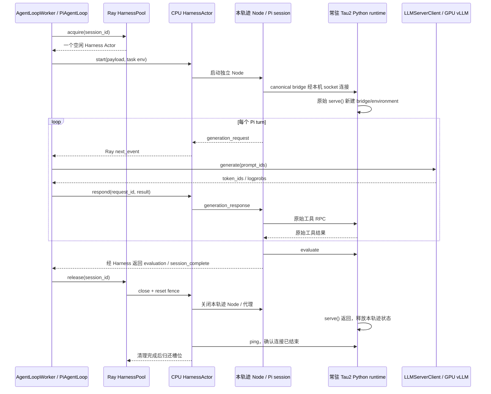

# Ray Harness Pool：实现、异常修复与真实 rollout 对照

## 结果与适用范围

2026-09-16 在 vGPUN 完成有效运行 `pi-harness-20260916-f`，执行提交
`c76e10fd89d5baae6b1704a321d039a7648ff244`，退出码 0。单卡 RTX 4080 SUPER，Qwen3-1.7B
真实 safetensors 权重；引擎日志确认 2/2 checkpoint shards 加载。CPU/GPU 全部在远程执行，
源码在本地编写、commit/push 后拉取。Tau2 原始源码未修改。

同一个已预热 vLLM 服务上，direct 与 pool 各测三批，每批四条轨迹：

| 指标 | 原 subprocess | 热 Ray Harness Pool |
|---|---:|---:|
| 批次耗时 s | 21.629 / 20.117 / 18.912 | 7.937 / 6.232 / 7.495 |
| 平均批次耗时 s | 20.219 | 7.222 |
| 首次 generation_request 到达前的平均等待 s | 12.373 | 2.809 |
| 同上，单轨迹范围 s | 8.537–17.744 | 2.035–3.339 |
| 有 LLM 请求在途的时间占比 | 43.47% | 61.19% |
| 按采样点加权的 GPU utilization | 17.36% | 27.24% |
| 正式测量轨迹数 / LLM 请求数 | 12 / 72 | 12 / 72 |
| 输出 tokens | 1464 | 1412 |

观测到热池平均 wall time 减少 64.28%，同批量吞吐比约 2.80。请求覆盖率按每批区间并集
再跨批加权，GPU utilization 按约 200 ms 样本加权；二者都不是精确 GPU kernel useful time。
首次 generation_request 是 Worker 收到 Pi 请求的时间，尚未包含该轮 prompt tokenization。

这是固定单个 Tau2 任务、单节点、小模型、四并发的 rollout 对照。没有运行 actor 更新，
benchmark 也未走 TransferQueue 训练输出后处理，不能把 2.80 写成完整训练 step 加速。
原生五轨迹 v1 GRPO 的初始化细分测量是另一独立实验，见
[startup breakdown](2026-09-16-pi-startup-breakdown-results.md)。

## 冷启动成本没有消失

Pool 的额外创建与准备 wall time 为 **34.723 s**，其中 Pool Actor 内等待全部槽位 ready
为 29.169 s。四个 Python runtime 的 import 分别为 6.276、7.281、20.548、22.435 s；
这些是并行区间，不能相加成 wall time。长尾说明环境初始化仍有明显波动。

- 原方案三批合计：60.657 s。
- 热池三批合计：21.665 s；加回一次池启动后：56.388 s。
- 因而这次三批累计只减少 **7.04%** 的时间，不能只引用热池倍数。
- 按本次平均每批差值估算，需要约 2.67 批摊平启动成本，即至少约三批。只运行首批时，
  池准备加首批为约 42.661 s，大于原方案首批 21.629 s。

共同的 GPU 初始化 57.492 s、Worker 初始化加 GPU warmup 24.204 s 单独保存于原始 JSON，
未计入双方上述 rollout 比较。该 warmup 本身也是四条真实 Pi/model 轨迹，但不进入三批均值。

## 工作量与语义核对

24 条正式测量轨迹的初始 tokenized prompt SHA-256 完全相同。每条都有六次真实生成、
真实工具 dispatch、终局评估、session completion 和精确生成 token/logprob 记录。
没有 rollout_error；模型生成存在两种完整 response-token SHA，分别为每轨迹 109 和 135 tokens。
温度为零仍没有得到全批 bitwise 相同输出；当前测试没有开启 batch-invariant/full-determinism。
Pool 总输出比 direct 少约 3.55%，因此总体 2.80 是此样本的观测吞吐比，不能声称严格等 token。

现有样本中还可以找到输出 token 序列组成完全一致的对照：

| 匹配条件 | direct s | pool s | 比值 |
|---|---:|---:|---:|
| 514 tokens；3 条相同的 135-token 轨迹 + 1 条相同的 109-token 轨迹 | 21.629 | 7.937 | 2.725 |
| 462 tokens；1 条相同的 135-token 轨迹 + 3 条相同的 109-token 轨迹 | 18.912 | 6.232 | 3.034 |

上述是事后匹配的两个批次对，不是额外独立实验，仍受调度/缓存/执行次序波动影响。
实际运行顺序为 direct → pool → pool → direct → direct → pool；两种模式共享同一 GPU
服务和 prefix cache，已准备的 Pool 在 direct 轮次也保持驻留。没有与独立本地进程池比较，
因此收益应归于解释器常驻、重复 import 摊销和更集中的请求到达，不能归于“Ray 本身更快”。

所有正式测量轨迹 reward=0、达到六轮上限，且每条有 1–2 个模型工具错误；它们是性能样本，
不是任务成功率或学习改进证据。对照 CPU 回归使用 scripted generations 验证真实 Pi/tool/
evaluator 语义；不混入以上 GPU 性能数字。

## 实现与资源边界

新增 `verl/experimental/agent_loop/pi/harness_pool.py`：

1. 命名 Pool Actor 管理有限槽位和租约。容量满时等待，支持取消等待，拒绝旧租约。
2. 每个 CPU Harness Actor 持有一个已导入 Tau2 的 Python 服务；Worker 通过 Ray RPC
   租用槽位、收取 Pi 事件、回复生成结果。
3. 每条轨迹仍创建独立 Node/Pi session。canonical extension 的原始 stdio bridge 请求经过
   Actor 本机 Unix socket 代理转发，未改工具/schema/任务 prompt/evaluator 业务实现。
4. 每次连接调用原始 `pi_bridge.serve()`，创建全新的 TelecomPiBridge、environment、任务缓存
   和调用记录。只共享导入模块，不共享任务对象；Node 也不复用。
5. 归还前关闭 Node/代理，并等待服务接受新的 ping，确认上一条 canonical serve 已返回。
   清理失败则隔离槽位并停止继续借出，不自动重放工具调用。
6. 服务/Node 带父进程存活检查；正常 shutdown 显式关闭子进程并回收临时 socket 目录。



四个 Python runtime PID `20503 / 20548 / 20526 / 20536` 在各自三次租用中保持不变，
每个最终 sessions=3。各自 RSS 高水位约 493–494 MiB，四个 Python runtime 合计约 1.93 GiB；
这不包含 Ray Actor、Node 和其他进程，未据此声称完整资源池峰值内存。只验证了单节点；
跨节点部署、长时间压力和 Actor 崩溃恢复尚未做性能验收。

## 发现与修复的异常

- c：脚本 Actor 序列化了旧 `_agent_loop_registry`，首批前 KeyError；改为方法执行时读取
  原生模块 registry。有效 f 已通过这一路径，共完成 28 条轨迹（含 warmup）。
- d：独立服务沿用训练用 `load_format=dummy`，但没有 actor 权重同步；中止并显式设置
  `safetensors`，另加启动断言。f 日志证实真实 checkpoint 加载。
- e：GitHub pull 超时导致旧提交仍在远程；核对后中止，改用已发布提交的 Git bundle
  fast-forward 同步，再以完整 HEAD 断言启动 f。

c/d/e 均不进入有效结果。详细修复前定位见
[analysis](2026-09-16-ray-harness-pool-analysis.md)。

## 验证、产物与运行方式

- 远程 36 个针对性 Python 测试通过，包含真实 Qwen tokenizer，容量、取消、旧租约，以及
  同一热解释器 A→B→A 的任务状态修改后 reset 与新进程 prompt/tool/evaluator 一致性。
- 初始计时探针 2 个真实 Pi SDK 测试通过；Python Ruff、Bash/Node 语法检查通过。
- 有效 GPU benchmark 退出码 0；结束后无自有 benchmark/service/sidecar/monitor 进程，
  GPU 恢复 0%、1 MiB。
- 原始远程目录：`/root/autodl-tmp/runs/pi-harness-20260916-f`。
- [逐批指标和配置](2026-09-16-ray-harness-benchmark.json)、
  [逐轨迹时间与 GPU/request 汇总](2026-09-16-ray-harness-timing.json)。

```bash
PI_RUN_DIR=/root/autodl-tmp/runs/pi-harness-new \
  bash examples/pi/tau2_telecom/run_harness_benchmark.sh
```

默认训练仍走 subprocess。PiAgentLoop 的实验性开关为 `PI_HARNESS_POOL_SIZE`、作业唯一的
`PI_HARNESS_POOL_NAME` 和 `PI_HARNESS_CPUS_PER_ACTOR`。本次验证的是 Worker/PiAgentLoop/
LLMServerManager 的独立 rollout 路径，未把开启池后的完整 GRPO trainer 更新作为验收结果。
